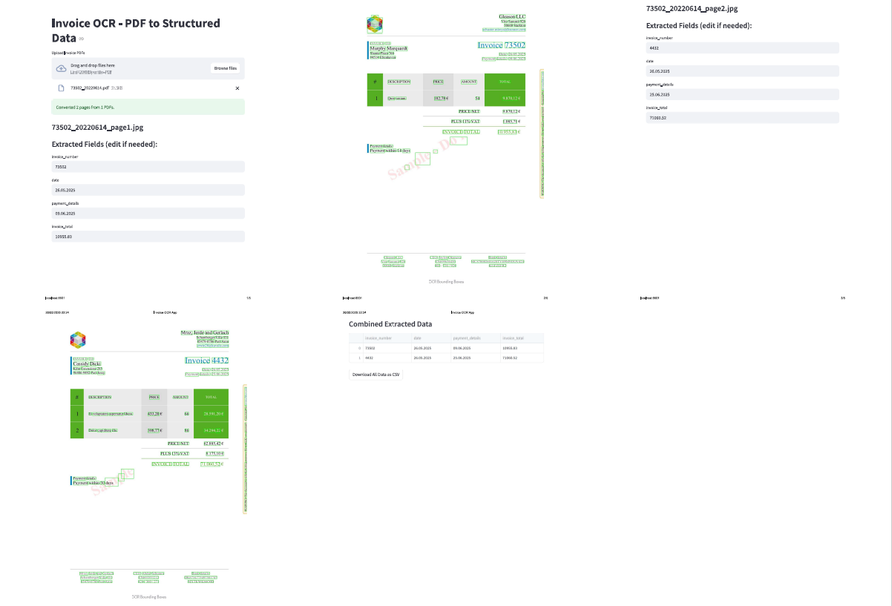

# Scan Invoices, Extract Value : building An OCR App with Tesseract and Streamlit 


## Project Overview
This project demonstrates an end-to-end pipeline for extracting key information from invoice/receipt PDFs using Optical Character Recognition (OCR) and natural language processing techniques. It automates:

* Converting multi-page PDFs to images

* Preprocessing images for better OCR accuracy

* Extracting text and parsing important fields (invoice number, date, total, vendor, etc.)

* Visualizing OCR bounding boxes

* Allowing manual correction of extracted data via a friendly Streamlit web app

---


## Features


* Batch PDF upload & multi-page support - PDF support via **Poppler**

* Automated PDF-to-image conversion

* Image preprocessing (grayscale, thresholding)

* **Tesseract** OCR with bounding box visualization

* Regex and heuristics for field extraction

*Editable extracted data via Streamlit UI

* Download cleaned CSV of all invoices
---

## Sample Data

Sample invoices were generated using [Invoicefaker](https://invoicefaker.com/), a tool that creates realistic invoice mockups for testing and stored in ``data/pdf``

---

## Project Structure
```
INVOICE_OCR/
│
├── app/                      # Web interface or CLI
│   └── app.py
│
├── data/                     # Store sample invoices (PDF/PNG)
│
│
├── poppler-24.08.0/          # Bundled poppler binaries (for Windows)
│
├── src/                      # Core OCR + Extraction modules
│   ├── extractor.py          # Extracts fields from OCR'd text
│   ├── ocr_engine.py         # Runs Tesseract OCR on preprocessed images
│   ├── pdf_converter.py      # Converts PDF invoices to images (using Poppler)
│   ├── preprocess.py         # Image preprocessing (thresholding, denoising)
│   ├── visualize.py          # Optional: draw boxes around detected text
│
│
├── main.py                   # Run full pipeline from image/PDF
├── README.md                 # README file
├── LICENSE                   # README file
└── requirements.txt          # requirements file
```

---

## Setup Instructions

### 1. Clone the Repository

```bash
git clone https://github.com/codebywiam/invoice-ocr.git
cd invoice-ocr
```

### 2. Create Virtual Environment

```bash
python -m venv venv
source venv/bin/activate  # or venv\Scripts\activate on Windows
```
### 3. Install Dependencies

```bash
pip install -r requirements.txt
```

### 4. Install Tesseract OCR

* Windows: Download from UB Mannheim

* macOS: brew install tesseract

* Linux: sudo apt install tesseract-ocr

Make sure tesseract is in the system PATH.

### 5. Install Poppler for PDF to image conversion
Poppler binaries are already included in the project under poppler-24.08.0.
or install 

Add paths to main.py and app.py

```python
poppler_bin_path = os.path.join(os.getcwd(), "poppler-24.08.0", "Library","bin")
pytesseract.pytesseract.tesseract_cmd = r"C:\Program Files\Tesseract-OCR\tesseract.exe"
```
---

## Run the Project
```bash
python main.py --headless
```
Output CSV will be saved in data/processed/``invoice_summary.csv``.

---

## Running the App

```bash
streamlit run app/app.py
```
* Upload multiple PDFs

* Preview OCR bounding boxes

* Edit extracted fields before download

* Download combined CSV



## How It Works
* PDF Converter: uses pdf2image to turn PDFs into JPEG images

* Preprocessing: converts images to grayscale and applies thresholding for clearer text

* OCR Engine: Tesseract OCR extracts text and bounding box info

* Extractor: uses regex and rules to identify invoice fields from raw text

* Visualizer: draws bounding boxes around recognized words

* Streamlit UI: allows uploading PDFs, viewing results, editing, and exporting data


## Example Extracted Fields

```json
{
  "invoice_number": "33824",
  "date": "26/05/2025",
  "payment_details": "24.08.2025",
  "total": 144570.81
}
```
## Potential Improvements
* Improve extraction accuracy with deep learning models

* Add database integration for bulk processing and storage

* Support more invoice templates and international formats

* Deploy on cloud platforms with scalable APIs

* Add JSON export & REST API

## License
This project is licensed under the MIT License. See the LICENSE file for details.
